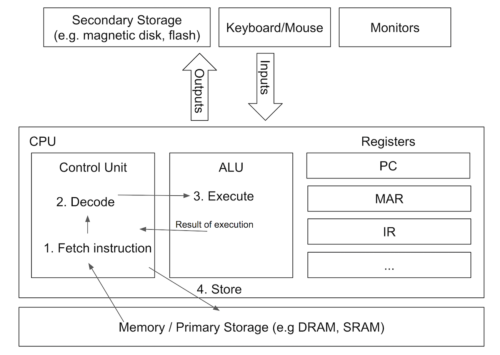

Components of a Computer

The fetch-decode-execute cycle describes how the CPU runs programs.

The cycle begins with the fetch stage, when the Control Unit (CU) fetches an instruction from memory. How does it know where in memory to look for instructions? It relies on a Program Counter (PC) to keep track of the next instruction address. The PC is incremented at the end of the cycle, but can also take on an entirely new value when some instructions are executed (e.g. ‘jump’ would put a new address into the PC, resulting in instructions to be fetched non-sequentially in memory). The CU accesses the content in memory by sending the value in the PC via an address bus, and the memory sends back the data/instruction via a data bus.

In the decode stage, the CU translates the instruction it to a series of smaller steps that it will execute in the next stage. In this stage, it identifies what operands are needed for execution, and maybe fetch them from memory into registers (e.g. ‘add x, y’ means we need to first resolve the values of x and y).

Finally, the CU executes the instruction, which might involve communicating with the rest of the processor -- it could signal the ALU to perform arithmetic/logic operations, or it could move data around, between memory and registers and I/O.
